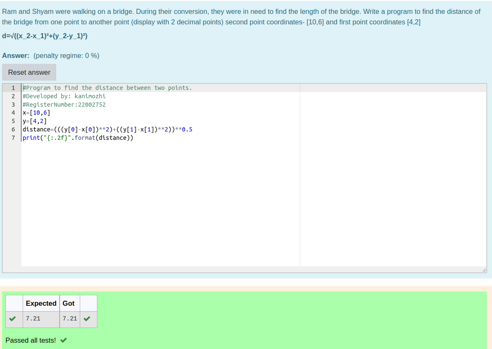

# DISTANCE-BETWEEN-TWO-POINTS


## AIM:

To write a python program to find the distance two 2 points

## ALGORITHM:

### Step 1: 
Import math

### Step 2: 
Assign the values of teo points

### Step 3: 
Substitute the values in the distance formula  

### Step 4: 
Print the values

### Step 5: 
End the program

### PROGRAM:
```python
'''
#Program to find the distance between two points.
#Developed by: kanimozhi
#RegisterNumber:22002752
'''
x=[10,6]
y=[4,2]
distance=(((y[0]-x[0])**2)+((y[1]-x[1])**2))**0.5
print("{:.2f}".format(distance))
```


### OUTPUT:



### RESULT:
Thus the distance between two points are successfully executed
